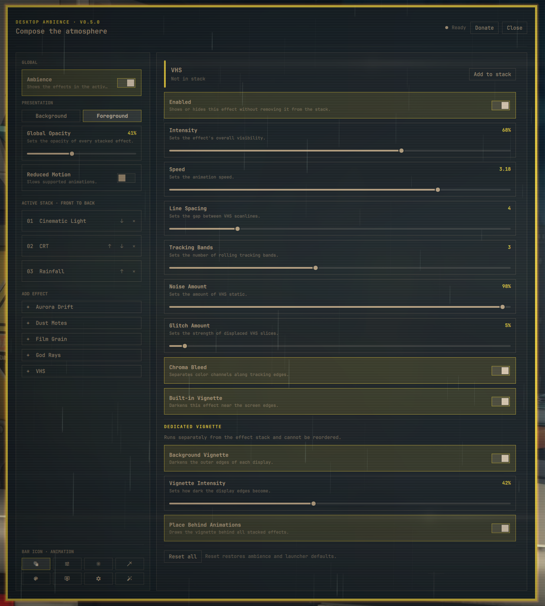

# Desktop Ambience

A standalone Omarchy Shell plugin for composing animated desktop atmosphere.
Ten ordered renderers share one persistent surface per output, while a
separate vignette can sit above or below the stack. The plugin owns its settings,
theme adaptation, settings window, and runtime status endpoint.

[](preview.png)

## Included effects

1. Aurora Drift
2. Cinematic Light
3. CRT
4. Dust Motes
5. Film Grain
6. God Rays
7. Rainfall
8. Tactical Grid
9. VHS (`trackingLines` in the settings file)
10. Bokeh (opt-in)
11. Dedicated background vignette

The ordered list is front-to-back: position 1 is topmost. The dedicated vignette
is intentionally outside that list.

## Requirements

- A current Omarchy installation with the stock Omarchy Shell running
- Quickshell and Hyprland as supplied by Omarchy
- Git for repository installation and upgrades

Omarchy plugins execute unsandboxed inside the long-running shell process.
Review third-party plugin code before enabling it.

## Install

Install from the public Git repository and enable it:

```bash
omarchy plugin add "https://github.com/OldJobobo/desktop-ambience.git" --enable
```

For a reviewed local checkout, run this from the repository root. This performs
a real Git clone into Omarchy's plugin directory; it does not create a
development symlink:

```bash
omarchy plugin add "file://$(pwd)" --enable --yes
```

If the repository was added without `--enable`, enable it later. New installs
place the single-instance launcher in the right bar section:

```bash
omarchy plugin enable jobo.desktop-ambience --section right
```

Install the optional Omarchy menu row from the cloned plugin. The helper is
idempotent and owns only its marked `desktop-ambience` entry:

```bash
"$HOME/.config/omarchy/plugins/jobo.desktop-ambience/scripts/menu-entry.sh" install
```

Avoid running multiple full-desktop effect systems at the same time. Their
layer surfaces can overlap even when both remain click-through.

## Open settings

Click the **Desktop Ambience** animation icon (`󰗘`) in the bar or choose **Desktop
Ambience** from the optional Omarchy menu row. Both launchers summon the same
persistent settings window and own no renderer or settings state themselves.
The bar icon can be changed from the **Bar Icon** section in plugin settings.
Choices include Animation, Tune, Blur, Magic staff, Palette, Monitor eye,
Vintage filter, and Auto-fix. Animation is the default. The selected icon is
stored with the widget's existing inline bar settings and updates every bar
surface without restarting the ambience renderer.

The equivalent shell command is:

```bash
omarchy-shell shell summon jobo.desktop-ambience '{}'
```

The window shows the installed plugin version and controls global enable,
background/foreground presentation, opacity, reduced motion, stack membership
and order, every effect setting, the dedicated vignette, save retry, and reset.
The **Donate** button opens [OldJobobo's Ko-fi](https://ko-fi.com/oldjobobo).

Inspect runtime state without opening the window:

```bash
omarchy-shell jobo-desktop-ambience status | jq
```

The status includes active order, loaded renderer count, per-output surfaces,
fullscreen suppression, settings persistence health, and theme-adapter health.

## Presentation behavior

Background mode uses a click-through, non-exclusive Bottom layer and is the
default. Foreground mode moves the same persistent surface to Overlay. It may
cover the stock bar, menus, and other Overlay UI depending on compositor mapping
order. A fullscreen application suppresses foreground paint only on its own
output; the surface and renderer tree remain alive.

## Settings and state

The only persistent plugin state is:

```text
$XDG_CONFIG_HOME/omarchy/jobo/desktop-ambience/settings.json
```

When `XDG_CONFIG_HOME` is unset, the path falls back to
`$HOME/.config/omarchy/jobo/desktop-ambience/settings.json`.

Writes are normalized, serialized, and atomically replaced. Unknown JSON-safe
fields are retained for forward compatibility. A malformed external edit keeps
the last valid runtime state and surfaces a repairable persistence error.

## Upgrade

Installed repository copies are Git-managed:

```bash
omarchy plugin update jobo.desktop-ambience
```

Omarchy fetches the configured origin, fast-forwards the checkout, validates the
manifest, and rescans plugins. Settings are versioned and normalized on load;
upgrades do not read or migrate state from other plugins.

When upgrading from a panel-only version, disable and re-enable once so Omarchy
moves the existing plugin entry into the bar layout:

```bash
omarchy plugin disable jobo.desktop-ambience
omarchy plugin enable jobo.desktop-ambience --section right
```

Re-running the menu helper refreshes the marker-owned row without creating a
duplicate:

```bash
"$HOME/.config/omarchy/plugins/jobo.desktop-ambience/scripts/menu-entry.sh" install
```

## Disable

Disable rendering and unload the plugin while preserving its settings:

```bash
omarchy plugin disable jobo.desktop-ambience
```

Re-enable it with:

```bash
omarchy plugin enable jobo.desktop-ambience
```

## Uninstall

Remove the optional menu row while the helper is still available, then remove
the installed Git checkout:

```bash
"$HOME/.config/omarchy/plugins/jobo.desktop-ambience/scripts/menu-entry.sh" remove
omarchy plugin remove jobo.desktop-ambience
```

Then remove the plugin-owned settings directory if no state should remain:

```bash
rm -rf -- "${XDG_CONFIG_HOME:-$HOME/.config}/omarchy/jobo/desktop-ambience"
```

No theme, Hyprland, `shell.json`, or unrelated application settings are owned or
modified by this plugin.

## Troubleshooting

### The plugin is not listed

Validate the checkout and ask the shell to discover plugins again:

```bash
omarchy plugin validate "$HOME/.config/omarchy/plugins/jobo.desktop-ambience"
omarchy-shell shell rescanPlugins
omarchy plugin list
```

### The bar icon or menu row is missing

Reinsert the bar widget and install the optional menu row:

```bash
omarchy plugin disable jobo.desktop-ambience
omarchy plugin enable jobo.desktop-ambience --section right
"$HOME/.config/omarchy/plugins/jobo.desktop-ambience/scripts/menu-entry.sh" install
```

### The settings window does not open

Confirm the plugin is enabled, then summon it directly:

```bash
omarchy plugin enable jobo.desktop-ambience
omarchy-shell shell summon jobo.desktop-ambience '{}'
```

### Effects are hidden in foreground mode

Check the per-output fullscreen state:

```bash
omarchy-shell jobo-desktop-ambience status | jq '.surfaces'
```

Foreground paint is intentionally suppressed on an output whose active
workspace contains a fullscreen application.

### A save failed

Use **Retry** in the settings window. The status endpoint reports the requested
and confirmed revisions plus the persistence error:

```bash
omarchy-shell jobo-desktop-ambience status | jq '.persistence'
```

### Foreground effects cover shell chrome

This is the documented Overlay policy. Switch **Presentation** to
**Background** in the settings window for a behind-windows surface.

## Development

The repository root is the installable plugin root. Run host-independent checks
while developing:

```bash
./scripts/check-contracts.sh
```

Before merging, run the complete suite from an active Omarchy Wayland session:

```bash
./scripts/check.sh
```

The complete suite validates the manifest, lints every QML file, checks shell
scripts, rejects forbidden runtime dependencies and extra file owners, runs all
behavior tests with zero skips, and checks the Git diff.

Run the reversible monitor lifecycle check when validating Hyprland hotplug:

```bash
JOBO_AMBIENCE_LIVE_HOTPLUG=1 python tests/live_phase3_hotplug.py
```

Run the complete Phase 6 release matrix only from a live Omarchy session. It
uses temporary XDG homes and headless outputs, briefly tests an advertised
alternate refresh rate, restores the original mode, and writes evidence under
`docs/release/evidence/<version>/`:

```bash
JOBO_AMBIENCE_LIVE_PHASE6=1 ./scripts/check-phase6.sh
```

Profile the Phase 7 per-effect matrix with isolated settings and reversible
headless outputs:

```bash
JOBO_AMBIENCE_LIVE_PHASE7=1 python tests/live_phase7_performance.py
```

Use `--target-root <worktree>` to compare another revision, or combine `--cases
dustMotes --repetitions 5` for a repeatable focused sample. Run the complete
performance and Phase 6 parity matrix before release:

```bash
JOBO_AMBIENCE_LIVE_PHASE7=1 ./scripts/check-phase7.sh
```

Findings and current machine evidence are documented in
[`docs/performance/phase7.md`](docs/performance/phase7.md).

Desktop Ambience is available under the [MIT License](LICENSE).

Versioning, pull-request checks, and the release process are defined in
[`CONTRIBUTING.md`](CONTRIBUTING.md). Release notes are kept in
[`CHANGELOG.md`](CHANGELOG.md). Validate a clean release candidate with:

```bash
./scripts/release-check.sh
```

Extraction provenance and milestone gates are documented in [`PLAN.md`](PLAN.md)
and [`docs/extraction-baseline.md`](docs/extraction-baseline.md).
